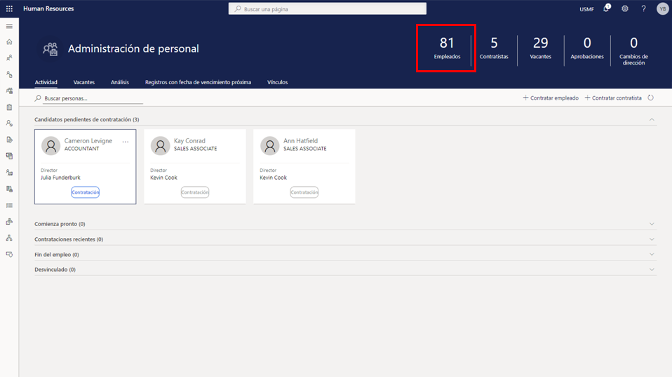

---
demo:
  title: 'Demostración 1: Asignar cursos de aprendizaje'
  module: 'Module 4: Learn the Fundamentals of Microsoft Dynamics 365 Human Resources'
---

## Demo 1: Asignar cursos de aprendizaje

1. Vaya a la página principal de **Microsoft Dynamics 365 Human Resources**.  
    En Microsoft Dynamics 365 Human Resources, la administración de personal puede asignar cursos de aprendizaje a los empleados. En este ejemplo, debe asignarse a la nueva contratación de la empresa, Alicia, el aprendizaje disponible para los empleados durante sus primeros treinta días.

1. En el selector de empresas de la parte superior derecha, compruebe que la empresa a la que se está conectando es **USMF**. De no ser así, cámbiela a **USMF**.

1. En la esquina superior izquierda de la pantalla, seleccione la pestaña **Administración de personal**.

1. En la parte derecha de la página **Administración de personal**, haga clic en el número sobre la palabra **Empleados**.

    

1. En la tabla **Empleados**, seleccione el nombre del empleado al que quiere asignarle el aprendizaje. Por ejemplo, **Alicia Thornber**.  
    Después, utilice la pestaña Competencias y desarrollo para ver los vínculos a la información sobre los certificados de los empleados, su educación y sus aptitudes.

1. En la página de empleados, seleccione la pestaña **Competencias y desarrollo**.

1. En la sección **Competencias**, seleccione **Cursos**.  
    Desde la página Cursos de un empleado, puede ver si hay algún curso asignado. En el caso de Alicia, no hay ninguno. Para ver los cursos disponibles para su asignación, seleccione el menú Id. del curso.

1. Seleccione el menú **Id. del curso**.

1. Seleccione el menú **Id. del curso** en la tabla Cursos.

1. Seleccione el menú **Estado del curso** en el menú **Id. del curso**.

1. Seleccione el cuadro **Estado exacto del curso** en el menú **Id. del curso**.  
    Después, tal vez deba editar el filtro de **Id. del curso** que se está aplicando, al modificar por ejemplo el filtro para mostrar solo los cursos abiertos.

1. Escriba **Abrir** en el cuadro **Estado exacto del curso**.

1. Seleccione **Aplicar** en el menú **Estado del curso** para ver todos los cursos abiertos disponibles.  
    Ahora puede asignar el curso de aprendizaje para nuevas contrataciones a Alicia.

1. Seleccione el curso que desea asignar. Por ejemplo, **00006 Aprendizaje nueva contratación**.

1. En el panel Transferir datos del curso, seleccione **Sí**.

1. En la columna **Fecha de inicio** de la página **Cursos**, seleccione el **icono del calendario**.

1. En el calendario, seleccione la fecha de inicio. Por ejemplo, **5 de enero de 2021**.

1. Seleccione el **icono del calendario** en la columna **Fecha de finalización**.

1. En el calendario, seleccione la fecha de finalización del aprendizaje. Por ejemplo, **8 de enero de 2021**.

1. En el lado izquierdo de la página **Cursos**, seleccione **Guardar** para guardar los cambios.

1. En el lado derecho de la página **Cursos**, seleccione **X** para cerrar la página.  
    Si necesita cambiar algún curso asignado, seleccione Cursos de nuevo.

1. En la página de **empleados**, en la sección **Competencias**, seleccione **Cursos**.

1. En la página **Cursos**, en la barra de navegación, seleccione **Editar** para hacer cambios.

1. Seleccione el **icono del calendario** en la columna **Fecha de inicio**.

1. Seleccione la nueva fecha de inicio del curso. Por ejemplo, **6 de enero de 2021**.

1. Seleccione **Guardar**.

1. Seleccione el icono **X** para cerrar la página.

1. Seleccione el icono **X** en la página de **empleados** para cerrarla.
