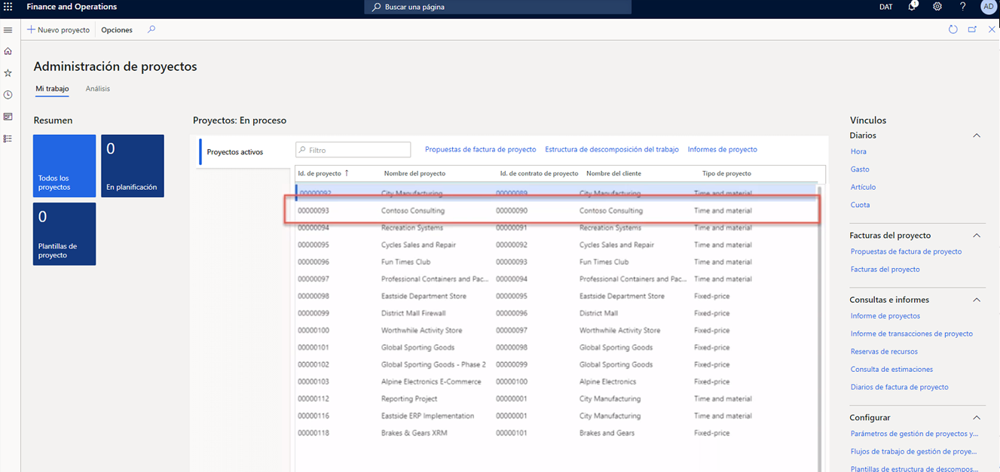

---
demo:
    title: 'Demo 1: Precios de Project Operations'
    module: 'Módulo 5: Aprender los Fundamentos de Dynamics 365 Project Operations'
---

## Demo 1: Precios de Project Operations

1. Vaya al área de trabajo **Administración de proyectos**.  
    En esta demo, configuraremos los precios de las venta y coste en Project Operations. También veremos cómo el coste y los precios derivan de una factura registrada previamente.

1. En el selector de empresas de la parte superior derecha, compruebe que la entidad legal a la que está conectado es **USSI**.  
    De no ser así, cambie la organización a **USSI**.

1. En la tabla **Proyectos activos**, seleccione el proyecto **00000093 Consultoría Contoso**. De esta forma se abre la vista de detalles del proyecto.

    

1. En la barra de navegación de la página **Consultoría Contoso**, seleccione la pestaña **Administrar**.

1. En el menú **Administrar**, seleccione **Diarios de facturas**.  
    Aquí hemos ubicado una factura donde se han aplicado las horas.

1. Debajo de **Transacciones de factura**, en la columna **Precio de venta**, apunte a **350**.  
    En esta vista podemos ver que el precio de venta del recurso Aaron Con, un director de proyectos de USSI, tiene una tarifa de cargo de 350 dólares. Vamos a revisar la configuración de los precios para ver cómo se ha determinado esa tarifa.

      

    Aunque podemos ver los precios de un proyecto individual, vamos a empezar por el área de trabajo **Administración de proyectos** para ver todos los precios configurados.

1. Vaya al área de trabajo **Administración de proyectos**.

1. En la parte derecha de la pantalla, en el submenú **Configuración** de la sección **Vínculos**, seleccione **Precio de venta (hora)**.

1. En la página **Precio de venta: hora**, en la columna **Precios** de la tabla, apunte a **350**.  
Desde esta vista, podemos ver dónde se configuró el precio de venta de 350 dólares de Aaron Con.

1. Apunte a la primera fila entera.  
    Si miramos toda la fila, podremos ver que Aaron está configurado como director de proyectos y, más específicamente, que la tarifa está asociada a una id. de proyecto específica para Consultoría Contoso.

1. En la columna **Recurso**, apunte al resto de filas con recursos asignados.  
    Podemos ver en esta tabla que hay otros directores de proyectos configurados también, pero no están asignados específicamente a otras id. de proyectos y, por eso, sus taridas son solo específicas para la categoría y los recursos asignados.

      

    Esta matriz es lo suficientemente flexible como para admitir el nivel de detalle que vimos con Consultoría Contoso y Aaron Con, además de admitir un modelo de precios más genérico, como el precio de 300 $ que se muestra aquí.

1. Para el proyecto Contoso, vaya a la página **Diarios de facturas**.  
    Volviendo a la factura registrada, veremos la misma transacción por horas registrada y revisaremos los costes asociados a Aaron Con al seleccionar la id. de transacción en la línea de transacción de la factura.

1. En la sección **Transacciones de factura**, seleccione la pestaña **Hora**. En la columna **Id. de transacción** de la tabla que aparece, seleccione Id. de transacción.

    

1. En la página **Transacciones por horas**, seleccione la pestaña **Información general**. En la columna **Precio de coste** de la tabla que aparece, apunte a **200**.  
    Desde la vista de transacciones por hora, podremos ver la entrada para Aaron Con y el precio de coste asociado de 200 $. Volvamos y revisemos la configuración del precio de coste para ver cómo ha derivado la tasa de coste.

1. Vaya al área de trabajo **Administración de proyectos**.

1. En la parte derecha de la pantalla, en el submenú **Configuración** de la sección **Vínculos**, seleccione **Precio de coste (hora)**.

1. En la tabla de la página **Precio de coste: hora Vista estándar**, apunte a la fila con **01/01/2014** de la columna **Fecha de vigencia**, a **Director de proyectos** de la columna **Categoría** y a **200** de la columna **Precio de coste**, pero a ningún valor del resto de columnas.  
    Desde esta vista se puede ver el precio de coste de 200 $ que se ha configurado específicamente para la categoría de Director de proyectos, pero no hay otras líneas específicas para Aaron o para nuestro proyecto de consultoría Contoso. Esta también es una práctica común, ya que muchas organizaciones de servicios aplican tarifas de coste estándares en todas las categorías, identificada en este caso como rol de proyecto. Este coste suele ser una tarifa combinada en la que la tasa de pago de recursos individuales solo se guardará en la nómina o en el sistema de recursos humanos. Después, la tasa de coste estándar se ajustará de forma periódica a medida que se van analizando los costes de nómina para garantizar que estos sean precisos y que se cumplan los márgenes.

    

1. Vaya al área de trabajo **Administración de proyectos**.

1. En la parte derecha de la pantalla, en el submenú **Configuración**, apunte a las secciones **Precio de coste (hora)** y **Precio de venta (hora)**.  

En esta demostración hemos analizado cómo se configuran los precios de venta y coste estándares en Project Operations. Hemos analizado también su impacto en una factura registrada para conocer cómo afecta directamente la configuración de estos precios a la factura de tiempo y material presentada.
