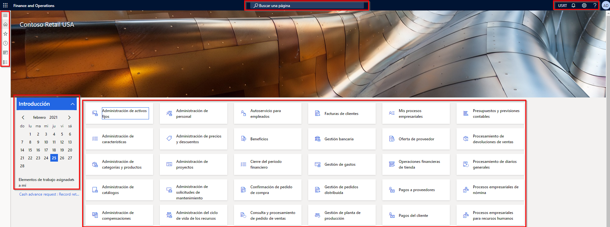
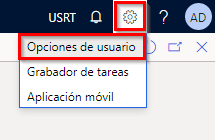
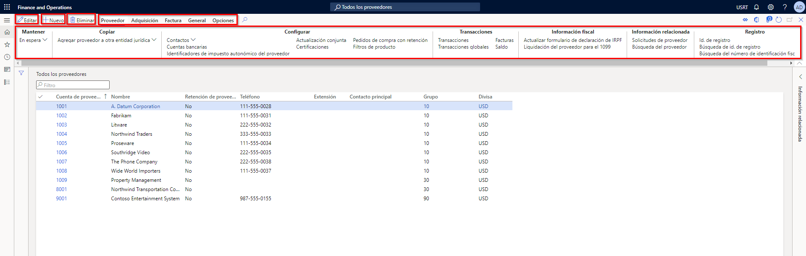

---
lab:
  title: "Laboratorio\_1: Navegar por las aplicaciones de Finance and Operations"
  module: 'Module 1: Explore the core capabilities of Dynamics 365 finance and operations apps'
---

# Módulo 1: Exploración de las capacidades principales de las aplicaciones de finanzas y operaciones de Dynamics 365

## Laboratorio 1: Navegar por las aplicaciones de Finance and Operations

## Objetivo

Ahora que se ha familiarizado con las aplicaciones de Finance and Operations, podrá dedicar tiempo a explorar la interfaz.

## Configuración del laboratorio

- **Tiempo estimado**: 10 minutos

## Instrucciones

### Iniciar sesión en el equipo del laboratorio

1.  Iniciar sesión en el equipo del laboratorio con credenciales:

    - Nombre de usuario: `Administrator`

    - Contraseña: `pass@word1`

1.  Antes de continuar, espere a que finalice el script AdminUserProvisioning. Esto podría tardar de 2 a 3 minutos. Una vez que el script se haya completado, por un momento aparecerá una casilla emergente para confirmar que el usuario Administrador se ha actualizado correctamente. 

1.  **Microsoft Edge** abrirá la dirección URL de Finance and Operations: <https://usnconeboxax1aos.cloud.onebox.dynamics.com>

1.  Inicie sesión con el nombre de usuario y la contraseña facilitados en el menú **Recursos**. 

### Navegar por las aplicaciones de Finance and Operations

1.  En la **página de inicio de Finance and Operations**, verá lo siguiente: 

    -  El menú de navegación de la izquierda que está contraído de forma predeterminada. 

    - Imagen de banner predeterminada de la empresa. 

    - Los iconos de área de trabajo que tiene a su disposición en función de su rol en la organización. 

    - Un calendario y los elementos de trabajo que tiene asignados. 

    - La barra **Buscar una página** que resulta muy útil para encontrar rápidamente lo que necesita. 

    - En la esquina superior derecha, aparece la empresa con la que está trabajando actualmente, así como notificaciones, opciones de configuración y vínculos de ayuda. 

    

1.  Compruebe que la empresa en la lista es **USMF**. 

1.  En la esquina superior izquierda, seleccione el menú de hamburguesa **Expandir el panel de navegación**. 

1.  El panel de navegación es donde encontrará colecciones de **Favoritos**, elementos **Recientes**, **Áreas de trabajo** y **Módulos**. 

1.  En el panel de navegación, seleccione **Módulos** > **Administración del sistema**. 

1.  **Revise** las áreas disponibles en el módulo **Administración del sistema**. 

1.  En **Configuración**, seleccione **Opciones de rendimiento del cliente**. 

1.  En el panel de opciones de rendimiento del cliente, en **Llamadas de características habilitadas**, seleccione el conmutador de alternancia y asegúrese de que está establecido en **Sí**. 

1.  Revise las otras opciones disponibles, desplácese hasta la parte inferior del panel y luego seleccione **Aceptar**. 

1.  En la página de inicio, en la esquina superior derecha, seleccione el icono **Configuración** y luego **Opciones de usuario**. 

    

1.  En la página **Opciones de usuario**, utilice las pestañas para establecer las diferentes opciones de configuración que se aplicarán a su cuenta. 

1.  Seleccione la pestaña **Preferencias**. 

1.  Revise las preferencias disponibles. Tenga en cuenta que puede cambiar la **empresa** predeterminada y la vista de **página inicial** que verá al iniciar sesión. 

1.  Seleccione y revise las pestañas **Cuenta** y **Flujo de trabajo**. 

1.  En el menú de navegación de la izquierda, seleccione el icono **Inicio**. 

1.  En la página de inicio, en la parte central superior de la página, seleccione el cuadro **Buscar una página**. 

1.  En el cuadro de búsqueda, escriba `All vendors`. 

1.  Es posible que deba esperar la primera vez que busque una página.  Verá un pequeño círculo giratorio a la derecha del cuadro de búsqueda mientras se procesa la búsqueda. 

1.  Seleccione el primer resultado de **Todos los proveedores**, es el mismo que navegar a **Módulos** > **Cuentas por pagar** > **Proveedores** > **Todos los proveedores**. 

1.  La página **Todos los proveedores** es un ejemplo de una página de lista. La página de lista generalmente contiene datos maestros que se pueden leer, crear, eliminar y actualizar. Verá funciones adicionales disponibles mediante el panel de acciones situado encima de la lista. 

    

1.  Resalte uno de los proveedores de la lista y, a la derecha, seleccione el panel de **Información relacionada** de la derecha y revise la información adicional que se da. 

1.  En la lista de proveedores, abra el registro **Acme Office Supplies**. 

1.  Seleccione **Editar** en el panel de acciones y, después, en el campo **Grupo** , seleccione el menú desplegable. A continuación, seleccione el título de la columna **Grupo de proveedores**. 

    

1.  Muchos menús ofrecen la posibilidad de **clasificación** y **filtrado**. Utilice los filtros para localizar rápidamente el contenido del campo que está buscando. Si ya conoce el valor, simplemente puede escribirlo en el campo, en lugar de usar el menú desplegable. 

1.  A la derecha del panel de acciones, observe la funcionalidad adicional. Mantenga el puntero sobre cada elemento y revise la llamada de características. 

1.  Seleccione el icono **Cerrar** para cerrar este registro y volver a la página de lista **Todos los proveedores** . 

    

1.  En la esquina superior derecha, seleccione el botón **?** de signo de interrogación y, a continuación, seleccione **Ayuda**. 

1.  Observe que el panel de información de ayuda muestra el contenido de la página actual. **Cierre** el panel Ayuda. 

1.  Vuelva al **panel predeterminado** mediante el vínculo **Finance and Operations** de la parte superior izquierda o el icono **Inicio** del menú de navegación izquierdo. 

    > **Nota:** método abreviado de teclado: Alt+Mayús+Inicio. Dynamics 365 Finance and Operations admite una gran cantidad de métodos abreviados de teclado para acelerar el acceso al sistema: https://learn.microsoft.com/en-us/dynamics365/fin-ops-core/fin-ops/get-started/shortcut-keys

1.  Trate de seleccionar un **icono de área de trabajo** y luego revise la información de ayuda de dicha área de trabajo. Cuando haya finalizado, vuelva al panel Predeterminado. 

