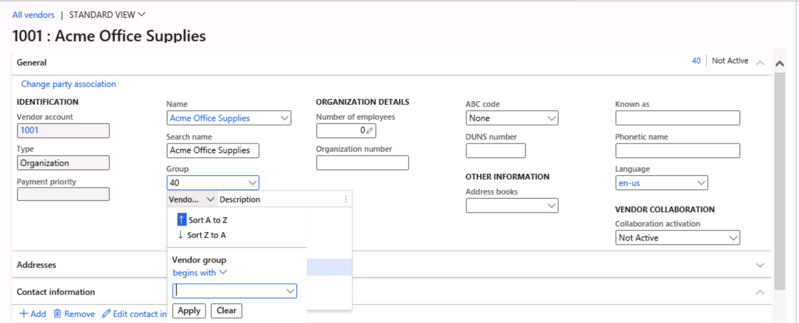

---
lab:
  title: "Laboratorio\_1: Navegar por las aplicaciones de Finance and Operations"
  module: 'Module 1: Explore the core capabilities of Dynamics 365 finance and operations apps'
---

# Módulo 1: Exploración de las capacidades principales de las aplicaciones de finanzas y operaciones de Dynamics 365

## Laboratorio 1: Navegar por las aplicaciones de Finance and Operations

## Objetivo

Ahora que se ha familiarizado con las aplicaciones de Finance and Operations, podrá dedicar tiempo a explorar la interfaz.

## Configuración del laboratorio

- **Tiempo estimado**: 10 minutos

## Instrucciones

### Iniciar sesión en el equipo del laboratorio

1.  Iniciar sesión en el equipo del laboratorio con credenciales:

    - Nombre de usuario: `Administrator`

    - Contraseña: `pass@word1`

1.  Antes de continuar, espere a que finalice el script AdminUserProvisioning. Esto podría tardar de 2 a 3 minutos. Una vez que el script se haya completado, por un momento aparecerá una casilla emergente para confirmar que el usuario Administrador se ha actualizado correctamente. 

1.  **Microsoft Edge** abrirá la dirección URL de Finance and Operations: <https://usnconeboxax1aos.cloud.onebox.dynamics.com>

1.  Inicie sesión con el nombre de usuario y la contraseña facilitados en el menú **Recursos**. 

### Navegar por las aplicaciones de Finance and Operations

Ahora que se ha familiarizado con las aplicaciones de finanzas y operaciones, podrá dedicar tiempo a explorar las interfaces.

1.  En la página de **inicio de Finance and Operations**, si está configurada, verá lo siguiente:

    - El menú de navegación de la izquierda que está contraído de forma predeterminada.

    - El logotipo de su empresa.

    - Los iconos de área de trabajo que tiene a su disposición en función de su rol en la organización.

    - Un calendario y los elementos de trabajo que tiene asignados.

    - La barra Buscar que resulta muy útil para encontrar rápidamente lo que necesita.

    - En la esquina superior derecha, aparece la empresa con la que está trabajando actualmente, así como notificaciones, opciones de configuración y vínculos de ayuda. Compruebe que la empresa en la lista es **USMF**.

    

2.  En la esquina superior izquierda, seleccione el menú de hamburguesa **Expandir el panel de navegación**.

3.  El panel de navegación es donde encontrará colecciones de **Favoritos**, elementos **Recientes**, **Áreas de trabajo** y **Módulos**.

4.  En el panel de navegación, seleccione **Módulos** > **Administración del sistema**.

5.  Revise las áreas disponibles en el módulo de administración del sistema.

6.  En **Configuración**, seleccione **Opciones de rendimiento del cliente**.

7.  En el panel **Opciones de rendimiento del cliente**, en **Llamadas de características habilitadas**, seleccione el conmutador de alternancia y asegúrese de que está establecido en **Sí**.

8.  Revise las otras opciones disponibles, desplácese hasta la parte inferior del panel y luego seleccione **Aceptar**.

9.  En la **Página de inicio**, en la esquina superior derecha, seleccione el icono **Configuración** y luego **Opciones de usuario**.

    

10. En la página **Opciones**, utilice las pestañas para establecer las diferentes opciones de configuración que se aplicarán a su cuenta.

11. Seleccione la pestaña **Preferencias**.

12. Revise las preferencias disponibles. Tenga en cuenta que puede cambiar la empresa predeterminada y la vista de página inicial al iniciar sesión.

13. Seleccione y revise las pestañas **Cuenta** y **Flujo de trabajo**.

14. En el menú de navegación de la izquierda, seleccione el icono **Inicio**.

15. En la página **Inicio**, en la parte central superior de la página, seleccione el cuadro **Buscar una página**.

16. En el cuadro de búsqueda, busque **Todos los proveedores**.

17. Vaya a **Todos los proveedores** Proveedores > Proveedores.

18. Es posible que deba esperar la primera vez que busque una página. Hay un pequeño círculo giratorio a la derecha del cuadro de búsqueda mientras se procesa la búsqueda.

19. La página **Todos los proveedores** es un ejemplo de una página de lista. La página de lista generalmente contiene datos maestros que se pueden leer, crear, eliminar y actualizar. Hay más características a través de la cinta de opciones situada encima de la lista.

    

20. Resalte uno de los proveedores de la lista y, a la derecha, seleccione el menú **Información relacionada** y revise la información adicional que se da.

21. En la lista de proveedores, seleccione **Acme Office Supplies**.

22. Seleccione el menú **Grupo** y luego seleccione el título de columna **Grupo de proveedores**.

    

23. Muchos menús ofrecen la posibilidad de clasificación y filtrado. Utilice los filtros para localizar rápidamente el contenido del campo que está buscando.

24. En la parte superior derecha, observe la funcionalidad adicional. Mueva el mouse a cada elemento y revise la descripción de la característica. Cuando termine, seleccione el icono **Cerrar** para cerrar la página y volver a la página **Inicio**.

    

25. En la parte superior derecha, seleccione el icono de signo de interrogación **Ayuda** y luego seleccione **Ayuda**.

26. Observe que la información de ayuda está relacionada con la página actual.

27. Trate de seleccionar un icono de área de trabajo y luego revise la información de ayuda de dicha área de trabajo. Al finalizar, vuelva a la página **Inicio**.

