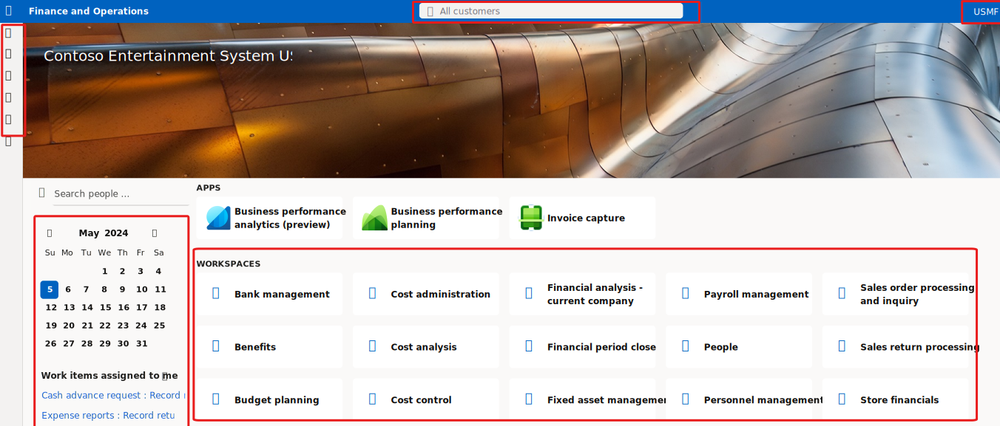
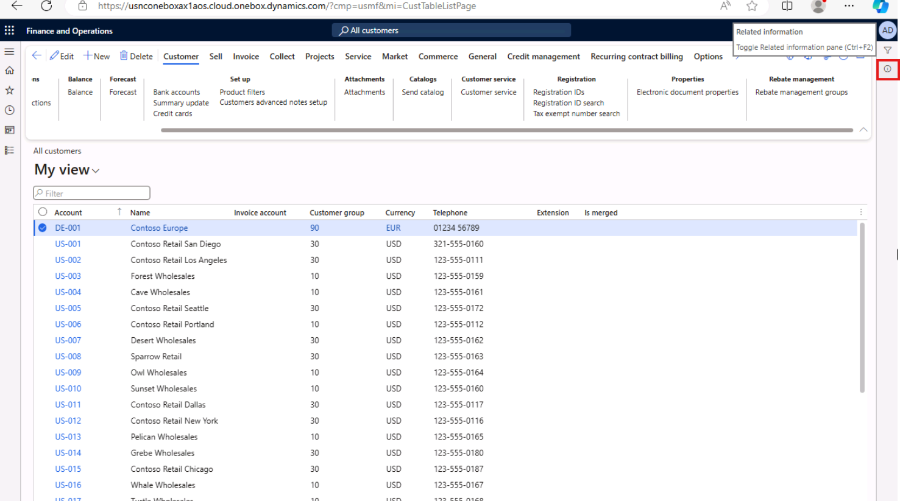

---
lab:
  title: "Laboratorio\_1.1: Navegar por las aplicaciones de finanzas y operaciones"
  module: 'Learning Path 1: Explore the core capabilities of Dynamics 365 finance and operations apps'
---

# Ruta de aprendizaje 1: Exploración de las capacidades principales de las aplicaciones de finanzas y operaciones de Dynamics 365
# Módulo 1: Descripción de las aplicaciones de finanzas y operaciones

## Laboratorio 1.1: Navegar por las aplicaciones de finanzas y operaciones

## Objetivo

Ahora que se ha familiarizado con las aplicaciones de Finance and Operations, podrá dedicar tiempo a explorar la interfaz.

## Configuración del laboratorio

- **Tiempo estimado**: 10 minutos

## Instrucciones

### Iniciar sesión en el equipo del laboratorio

1.  Iniciar sesión en el equipo del laboratorio con credenciales:

    - Nombre de usuario: `Administrator`

    - Contraseña: `pass@word1`

1.  Este laboratorio se ha configurado para aprovisionar automáticamente tu cuenta de usuario administrador. Una vez completado, Edge se abrirá automáticamente y te pedirá que inicies sesión. Puedes iniciar sesión con las credenciales proporcionadas que se encuentran en la pestaña Recursos. Si se produce un error en este proceso, revisa la nota siguiente. De lo contrario, puedes avanzar con el laboratorio. 

    >En el Escritorio, haz doble clic en AdminUserProvisioning.
En el campo Dirección de correo electrónico, escribe el nombre de usuario en **Recursos** y, a continuación, haz clic en Enviar.
Espera a que se te pida que informes al usuario administrador actualizado correctamente para... A continuación, haga clic en Aceptar.   

1.  **Microsoft Edge** abrirá la dirección URL de Finance and Operations: <https://usnconeboxax1aos.cloud.onebox.dynamics.com>

1.  Inicie sesión con el nombre de usuario y la contraseña facilitados en el menú **Recursos**. 

### Navegar por las aplicaciones de Finance and Operations

Ahora que se ha familiarizado con las aplicaciones de finanzas y operaciones, podrá dedicar tiempo a explorar las interfaces.

1.  En la página de **inicio de Finance and Operations**, si está configurada, verá lo siguiente:

    - El menú de navegación de la izquierda que está contraído de forma predeterminada.

    - El logotipo de su empresa.

    - Los iconos de área de trabajo que tiene a su disposición en función de su rol en la organización.

    - Un calendario y los elementos de trabajo que tiene asignados.

    - La barra Buscar que resulta muy útil para encontrar rápidamente lo que necesitas.

    - En la esquina superior derecha, aparece la empresa con la que está trabajando actualmente, así como notificaciones, opciones de configuración y vínculos de ayuda. Compruebe que la empresa en la lista es **USMF**.

    
2.  En la esquina superior izquierda, seleccione el menú de hamburguesa **Expandir el panel de navegación**.

3.  El panel de navegación es donde encontrará colecciones de **Favoritos**, elementos **Recientes**, **Áreas de trabajo** y **Módulos**.

4.  En el panel de navegación, seleccione **Módulos** > **Administración del sistema**.

5.  Revise las áreas disponibles en el módulo de administración del sistema.

6.  En **Configuración**, seleccione **Opciones de rendimiento del cliente**.

7.  En el panel **Opciones de rendimiento del cliente**, en **Llamadas de características habilitadas**, seleccione el conmutador de alternancia y asegúrese de que está establecido en **Sí**.

8.  Revise las otras opciones disponibles, desplácese hasta la parte inferior del panel y luego seleccione **Aceptar**.

9.  En la **Página de inicio**, en la esquina superior derecha, seleccione el icono **Configuración** y luego **Opciones de usuario**.

    

10. En la página **Opciones**, utilice las pestañas para establecer las diferentes opciones de configuración que se aplicarán a su cuenta.

11. Seleccione la pestaña **Preferencias**.

12. Revise las preferencias disponibles. Tenga en cuenta que puede cambiar la empresa predeterminada y la vista de página inicial al iniciar sesión.

13. Seleccione y revise las pestañas **Cuenta** y **Flujo de trabajo**.

14. En el menú de navegación de la izquierda, seleccione el icono **Inicio**.

15. En la página **Inicio**, en la parte central superior de la página, seleccione el cuadro **Buscar una página**.

16. En el cuadro de búsqueda, busca **Todos los clientes**.

17. Selecciona la página **Cuentas por cobrar** > **Clientes** > **Todos los clientes**. 

18. Es posible que deba esperar la primera vez que busque una página. Un pequeño círculo giratorio a la derecha del cuadro de búsqueda durante el proceso de búsqueda.

19. La página **Todos los clientes** es un ejemplo de una página de lista. La página de lista generalmente contiene datos maestros que se pueden leer, crear, eliminar y actualizar. Hay más características disponibles en la barra de herramientas situada encima de la lista.

    

20. Resalta uno de los clientes de la lista y, a la derecha, selecciona el menú **Información relacionada** y revisa la información que se proporciona.

    

21. En la lista **Clientes**, selecciona **Contoso Retail San Diego**.

22. Selecciona el menú **Grupo** y después selecciona el título de columna **Grupo de clientes**.

    

23. Muchos menús ofrecen la posibilidad de clasificación y filtrado. Utilice los filtros para localizar rápidamente el contenido del campo que está buscando.

24. En la parte superior derecha, observe la funcionalidad adicional. Mueva el mouse a cada elemento y revise la descripción de la característica. Cuando termine, seleccione el icono **Cerrar** para cerrar la página y volver a la página **Inicio**.

    

