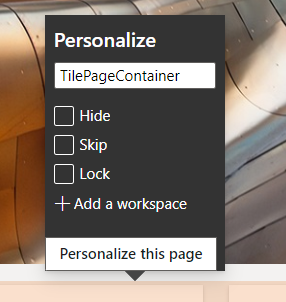
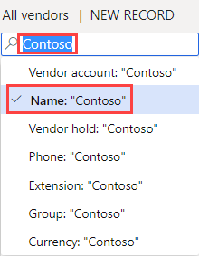

---
lab:
    title: 'Laboratorio 2: Explorar las áreas de trabajo y el filtrado'
    module: 'Módulo 1: Aprender los fundamentos de Microsoft Dynamics 365 Supply Chain Management'
---

# Módulo 1: Obtener información sobre los fundamentos de Microsoft Dynamics 365 Supply Chain Management

## Laboratorio 2: Explorar las áreas de trabajo y el filtrado

## Objetivos

Al iniciar sesión por primera vez en Finance and Operations están disponibles numerosas áreas de trabajo integradas. También puede crear su propia área de trabajo con contenido específico para una necesidad que pueda tener. Las áreas de trabajo son una de las numerosas características de Dynamics 365, pero también debe tener en cuenta que el filtrado es lo que permite realmente llegar a los elementos específicos que puede que esté buscando. Debe crear una nueva área de trabajo personalizada y utilizar filtros para identificar los diferentes elementos que necesita.

## Configuración del laboratorio

   - **Tiempo estimado**: 10 minutos

## Instrucciones

1. En la página de inicio de Finance and Operations, a la derecha de los iconos del área de trabajo, haga clic con el botón derecho o mantenga pulsada una área en blanco para activar el menú.

    

1. En el menú, seleccione **Personalizar: TilePageContainer**.

1. En la ventana Personalizar, seleccione **+Agregar un área de trabajo**.

1. Si la ventana Personalizar pequeña no está visible, trate de desplazarse hacia arriba en la página de inicio y haga clic con el botón derecho o bien pulse y mantenga pulsado y luego seleccione de nuevo **Personalizar: TilePageContainer**.

    

1. En la página de inicio, desplácese hacia abajo y busque el nuevo icono **Mi área de trabajo 1**.

    

1. Haga clic con el botón derecho o bien pulse y mantenga pulsado el icono y, después, seleccione **Personalizar: Mi área de trabajo 1**.

1. En la ventana Personalizar, cambie el nombre de Mi área de trabajo 1 a **Mi área de trabajo** y, después, seleccione **Personalizar esta página**.  
    El cambio de nombre se guardará automáticamente.

1. En la barra de herramientas que se abre, seleccione **Mover**.

    

1. Seleccione su icono **Mi área de trabajo** y muévalo a otra ubicación en la página de inicio.

    >[!Nota] Si no puede mover el icono, recargue la página y vuelva a probar los pasos anteriores para mover el icono.

1. Cierre la barra de herramientas.

1. En la página de inicio, en el cuadro **Buscar una página**, busque y seleccione **Todos los proveedores**.

1. En la página Todos los proveedores, en el menú superior, seleccione **Opciones** > **Agregar al área de trabajo**.

1. En el cuadro de filtro **Área de trabajo**, especifique **Mi área de trabajo** y seleccione el área de trabajo.

1. Seleccione el menú Presentación, revise las opciones disponibles y, luego, seleccione **Icono**.

1. Cuando termine, seleccione **Configurar**.

1. En el panel Agregar como icono, compruebe el nombre del icono y luego seleccione **Aceptar**.

1. En el panel de navegación de la izquierda, seleccione el icono **Inicio**.

1. En la página de inicio, seleccione su nueva área de trabajo.

1. En la página Mi área de trabajo, compruebe que aparece el icono de proveedores recién agregado.

1. Seleccione el icono **Proveedores**.

1. En la página Todos los proveedores, en el cuadro **Filtrar**, especifique **Contoso**.

1. Revise los diferentes campos que se pueden usar para buscar Contoso.

    

1. Seleccione **Nombre: “Contoso”** y compruebe los resultados del filtro.

1. Borre el cuadro de filtro y presione Entrar para ver todos los proveedores.

1. Seleccione el título de la columna **Grupo**.

    

1. Puede usar esto para ordenar los grupos de menor a mayor (Ordenar de la A a la Z) o de mayor a menor (Ordenar de la Z a la A).

1. En **Grupo**, seleccione el menú **empieza por** y revise los operadores de comparación. Seleccione **es exactamente**.

1. Seleccione el menú **es exactamente** de abajo y luego seleccione **Otros proveedores**.  
    También puede escribir un valor en el campo del menú.

1. Seleccione **Aplicar** y luego consulte los resultados. Observe el icono de filtro en el encabezado de la columna Grupo.

    

1. Seleccione la columna **Grupo** y luego, en el menú de filtro, seleccione **Borrar**.

1. A la izquierda del título Todos los proveedores, seleccione el icono de Filtro.

    

1. En la esquina superior derecha del panel de filtro, seleccione **+ Agregar**.

1. En el panel Agregar campos de filtro, seleccione el cuadro a la izquierda de **Grupo** y luego seleccione Actualizar.

1. Observe el filtro adicional que se ha agregado. Esto le permitirá filtrar la lista por más de un criterio.

    

1. En el filtro **La cuenta del proveedor empieza por**, seleccione el menú y luego seleccione **Northwind Traders**.

1. En el filtro **El grupo comienza por**, seleccione el menú y luego **30**.

1. Seleccione **Aplicar** y luego revise los resultados del filtro.

1. En el panel Filtros, seleccione **Restablecer** y observe que el filtro adicional se ha quitado y que el filtro predeterminado se ha restablecido a un valor vacío.

1. En la barra de la cinta, seleccione **Opciones** y luego, en las secciones de Opciones de página, seleccione **Ordenación o filtro avanzados**.

    

1. En la ventana Consulta - Proveedores, seleccione **+ Agregar**.

1. En la nueva fila, en la celda Campo, seleccione el menú y luego seleccione **Grupo**.

1. También puede seleccionar el menú, comenzar a escribir el nombre del grupo y luego seleccionarlo de los resultados del filtro.

1. En la celda Criterios, seleccione el icono **Abrir**.

    

1. En la lista Grupo de proveedores, seleccione **30, Otros proveedores**.

1. Para guardar la nueva consulta, en **Seleccionar consulta**, seleccione el menú **Modificar** y luego seleccione **Guardar como**.

    

1. En el panel de consulta Guardar, en el cuadro **Nombre**, especifique Mi consulta y luego seleccione **Aceptar**.

1. En la página Consulta - Proveedores, seleccione **Aceptar**.

1. Compruebe que la lista refleje los resultados de la consulta recién creada.

1. Para quitar el filtro, seleccione **Ordenación o filtro avanzados** y luego, en la página Consulta - Proveedores, seleccione **Restablecer** y, después, **Aceptar**.

1. Se restablecerá la consulta pero no se eliminará su consulta guardada.
