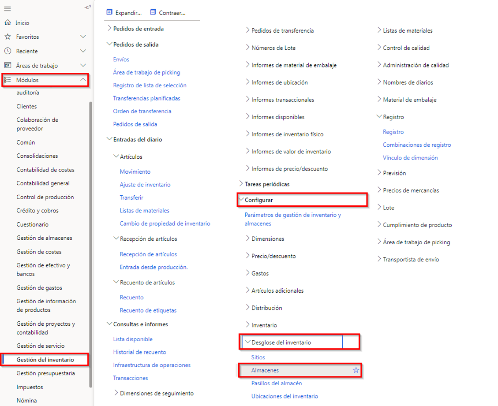

---
lab:
  title: 'Laboratorio 5: Crear un almacén'
  module: 'Module 1: Learn the Fundamentals of Microsoft Dynamics 365 Supply Chain Management'
ms.openlocfilehash: 919ea602b0768683acd845dd184b3bf5a0364fd0
ms.sourcegitcommit: 252458fca8e71b6e5e8b99ae4c2b47cd85461a30
ms.translationtype: HT
ms.contentlocale: es-ES
ms.lasthandoff: 01/27/2022
ms.locfileid: "137909758"
---
# Módulo 1: Obtener información sobre los fundamentos de Microsoft Dynamics 365 Supply Chain Management

## Laboratorio 5: Crear un Almacén

## Objetivos
El Sistema de administración de almacenes de Supply Chain Management ofrece formas flexibles de definir el diseño de su almacén para satisfacer las necesidades cambiantes, con el fin de conseguir la máxima eficiencia del almacén.

- Puede establecer áreas de almacenamiento de alta y baja prioridad para la colocación óptima de los productos.
- Puede dividir su almacén en zonas para acomodar diversas necesidades de almacenamiento, como requisitos de temperatura o varios índices de rotación de artículos.
- Puede especificar las ubicaciones del almacén en cualquier nivel (por ejemplo, sitio, almacén, pasillo, estantería, balda y hueco).
- Puede agrupar ubicaciones con los ajustes de las restricciones de capacidad física.
- Puede controlar cómo se almacenan y seleccionan los artículos, según las reglas definidas por la consulta.

Para usar la gestión de almacenes en Supply Chain Management, debe crear un almacén y habilitarlo para actividades de gestión de almacenes más avanzadas o especializadas.

## Configuración del laboratorio

   - **Tiempo estimado**: 10 minutos

## Instrucciones

1. En la página de inicio de Finance and Operations, en la parte superior derecha, compruebe que esté trabajando con la empresa USMF.

1. Si es necesario, seleccione la empresa y, en el menú, seleccione **USMF**.

1. En el panel de navegación izquierdo, seleccione **Módulos** > **Gestión de inventario** > **Configuración** > **Desglose del inventario** > **Almacenes**.

    

1. En la página Almacenes, en el menú superior, seleccione **Nuevo**.

1. En el campo **Almacén**, escriba **101**.

1. En el campo **Nombre**, introduzca **Almacén de desbordamiento**.

1. Seleccione el menú **Sitio** y, después, **3 Producción de espuma casera**.

1. Expanda **Nombres de ubicación**.  
    Las opciones de esta sección definen el formato predeterminado para los nombres de ubicación.

1. Establezca las opciones **Incluir pasillo** e **Incluir estantería** en **Sí**.

1. En el cuadro **Formato**, para la estantería, introduzca un valor.  
    Por ejemplo, si el formato del nombre de la ubicación de la estantería debe contener OVFL, debe escribir ese valor en el cuadro Formato.

1. En **NIVEL**, establezca la opción **Incluir estante** en **Sí**.

1. En el campo **Formato**, para el estante, introduzca **-##** .

1. En el menú superior, seleccione **Almacén**.

    

1. En **Mantener**, seleccione **Asistente para ubicación**.

1. En la página de bienvenida, revise la información y, a continuación, en la esquina inferior derecha, seleccione **Siguiente**.

1. Desmarque las casillas **Muelles de salida** y **Ubicaciones de almacenaje**.

1. Seleccione **Siguiente** y revise la información.

1. Continúe hacia cada página y, cuando termine, seleccione **Finalizar**.

1. Cierre la página y vuelva a la página de inicio.
