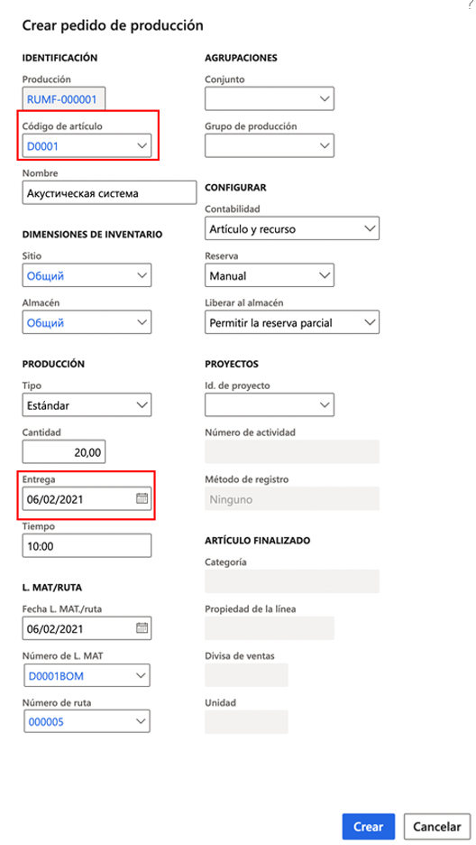

---
lab:
    title: 'Laboratorio 6: Crear un pedido de producción'
    module: 'Módulo 1: Aprender los fundamentos de Microsoft Dynamics 365 Supply Chain Management'
---

## Laboratorio 6: Crear un pedido de producción

## Objetivos

El pedido de producción contiene información sobre lo que se va a producir, cuánto se va a producir y la fecha de finalización planificada. También contiene información sobre qué materiales consumir y qué proceso seguir para producir el artículo.

Debe crear un nuevo pedido de producción para su empresa.

## Configuración del laboratorio

   - **Tiempo estimado**: 5 minutos

## Instrucciones

1. En la página de inicio de Finance and Operations, en la parte superior derecha, compruebe que esté trabajando con la empresa USMF.

1. Si es necesario, seleccione la empresa y, en el menú, seleccione **USMF**.

1. En el panel de navegación izquierdo, seleccione **Módulos** > **Control de producción** > **Pedidos de producción** > **Todos los pedidos de producción**.

1. En el menú superior, seleccione **Nuevo pedido de producción**.

1. En **IDENTIFICACIÓN**, en el cuadro **Número de artículo**, escriba **D0001** y luego seleccione el artículo identificado.

1. En **PRODUCCIÓN**, en el cuadro **Entrega**, seleccione una fecha un mes después de la fecha de hoy.  
    La fecha de entrega indica cuándo debe finalizar el pedido de producción para entregar a tiempo. Esta fecha se puede usar en el proceso de programación. Por ejemplo, puede programar el pedido hacia atrás desde la fecha de entrega.

1. En el cuadro **Cantidad**, escriba **20**.

1. En **L. MAT/RUTA**, el campo Número de L. MAT muestra automáticamente el número de cualquier L. MAT activa para el producto actual, pero puede cambiar la L. MAT del pedido de producción si selecciona una L. MAT activa de la lista de versiones de L. MAT aprobadas. El campo Número de ruta muestra automáticamente el número de cualquier ruta activa para el producto actual, pero puede cambiar la ruta del pedido de producción si selecciona una ruta activa de la lista de versiones de rutas aprobadas.

    

1. Seleccione **Crear**.
