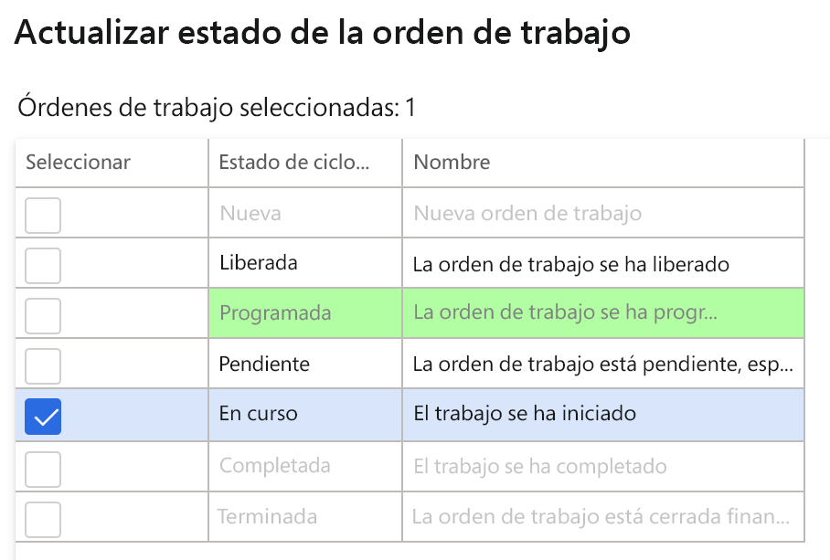
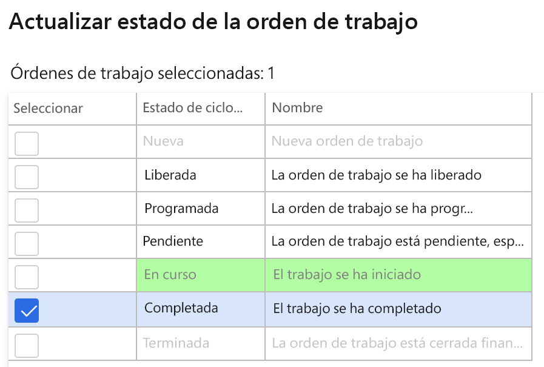

---
lab:
  title: 'Laboratorio 7: Crear una orden de trabajo de mantenimiento'
  module: 'Module 1: Learn the Fundamentals of Microsoft Dynamics 365 Supply Chain Management'
ms.openlocfilehash: ae848333194143720a6f5ebb598d5d566bc2260f
ms.sourcegitcommit: 252458fca8e71b6e5e8b99ae4c2b47cd85461a30
ms.translationtype: HT
ms.contentlocale: es-ES
ms.lasthandoff: 01/27/2022
ms.locfileid: "137909999"
---
## Laboratorio 7: Crear una orden de trabajo de mantenimiento

**Objetivos**

Las órdenes de mantenimiento realizadas en el sistema describen el mantenimiento o la reparación necesarios para un activo. Además, se utilizan para asignar los recursos adecuados para completar la solicitud de mantenimiento. La orden de trabajo se crea según la orden de mantenimiento, que la ejecutará el recurso asignado.

**Configuración del laboratorio**

Tiempo estimado: 15 min.

**Instrucciones**

1. En la página de inicio de Finance and Operations, en la parte superior derecha, compruebe que esté trabajando con la empresa USMF.

2. Si es necesario, seleccione la empresa y, en el menú, seleccione **USMF**.

3. En el panel de navegación izquierdo, seleccione **Módulos** **&gt; Administración de activos &gt; Configuración &gt; Solicitud de mantenimiento &gt; Estados de ciclo de vida.**

4. Seleccione En progreso y haga clic en el botón **Editar** del panel de acciones.

5. En la pestaña **General**, cambie el valor de **Crear orden de trabajo** a Sí.

6. En el panel de navegación izquierdo, seleccione **Módulos** **&gt; Administración de activos &gt; Áreas de trabajo &gt; Administración de la solicitud de mantenimiento.**

7. Haga clic en **Crear solicitud de mantenimiento.**

8. Escriba los siguientes valores en los campos del cuadro de diálogo y haga clic en el botón **Aceptar**.

    - Tipo de solicitud de mantenimiento: Corrección

    - Descripción: Ruido en el detector de metales

    - Ubicación técnica: PP-02-02

    - Recurso: MD-201

    - Nivel de servicio: 4

    - Síntoma del error: Ruido excesivo

    - Área de defecto: Electricidad 

9. Cierre el formulario de **Solicitud de mantenimiento** y vuelva al área de trabajo **Administración de solicitudes de mantenimiento**.

10. Actualice la página mediante el icono **Actualizar** situado en la esquina superior derecha de la pantalla.

11. La nueva solicitud de mantenimiento aparecerá en la lista de solicitudes de mantenimiento sin orden de trabajo.

12. Seleccione la nueva solicitud de mantenimiento y haga clic en el botón **Actualizar estado de la solicitud de mantenimiento**. 

13. En el cuadro de diálogo, seleccione la casilla de verificación junto a En progreso y haga clic en **Aceptar**

 

14. Seleccione la nueva solicitud de mantenimiento y haga clic en el botón **Crear orden de trabajo**. 

15. Escriba los siguientes valores en los campos del cuadro de diálogo y haga clic en el botón **Aceptar**.

    - Tipo de trabajo de mantenimiento: Inspección

16. Se creará una nueva orden de trabajo, y se actualizará en el registro de solicitud de mantenimiento seleccionado.

17. Haga clic en la orden de trabajo y vaya a la pantalla **Detalles de la orden de trabajo**.

18. En la orden de trabajo Lines, haga clic en el botón **Enviar**.

19. Escriba los siguientes valores en los campos del cuadro de diálogo y haga clic en el botón **Aceptar**.

    - Trabajador: Ted Howard

20. En el menú Acción, vaya a **Orden de trabajo &gt; Estado de ciclo de vida &gt; Actualizar estado de la orden de trabajo**.

21. En el cuadro de diálogo, seleccione la casilla de verificación junto a En progreso y haga clic en **Aceptar**

22. Seleccione la fecha y hora de **comienzo real** en el cuadro de diálogo y haga clic en **Aceptar**.

23. En el menú de acciones de la orden de trabajo, vaya de nuevo a **Orden de trabajo &gt; Estado de ciclo de vida &gt; Actualizar estado de la orden de trabajo**.

24. En el cuadro de diálogo, seleccione la casilla de verificación junto a Completada y haga clic en **Aceptar**

25. En el campo **finalización real** seleccione una fecha y hora posterior a la fecha y hora de comienzo y haga clic en Aceptar.

26. El estado actual de ciclo de vida de la orden de trabajo aparecerá con el valor Completada en el encabezado de la orden de trabajo.
