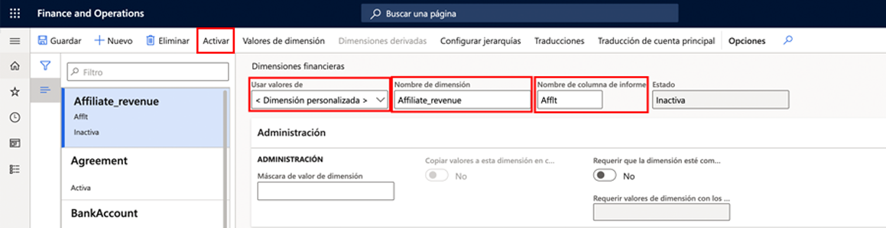
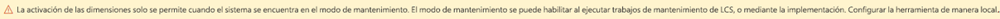

---
lab:
  title: 'Laboratorio 1: Crear una dimensión financiera'
  module: 'Module 2: Learn the Fundamentals of Microsoft Dynamics 365 Finance'
ms.openlocfilehash: 9bbc1a92cb719b988ddfa6a08e1e3b2d8c69976e
ms.sourcegitcommit: 252458fca8e71b6e5e8b99ae4c2b47cd85461a30
ms.translationtype: HT
ms.contentlocale: es-ES
ms.lasthandoff: 01/27/2022
ms.locfileid: "137910026"
---
## Laboratorio 1: Crear una dimensión financiera

## Objetivos

Use la página Dimensiones financieras para crear dimensiones financieras que pueda usar como segmentos de cuenta para planes de cuentas. Existen dos tipos de dimensiones financieras: dimensiones personalizadas y dimensiones respaldadas por entidades. Las dimensiones personalizadas se comparten entre entidades jurídicas y los usuarios especifican y mantienen los valores. Para las dimensiones respaldadas por entidades, los valores se definen en otro lugar del sistema, como en las entidades Clientes o Tiendas. Algunas dimensiones respaldadas por entidades se comparten entre entidades jurídicas, mientras que otras dimensiones respaldadas por entidades son específicas de las empresas.

Debe crear una dimensión financiera personalizada que se utilizará para su empresa.

## Configuración del laboratorio

   - **Tiempo estimado**: 5 minutos

## Instrucciones

1. En la página de inicio de Finance and Operations, en la parte superior derecha, compruebe que esté trabajando con la empresa USMF.

1. Si es necesario, seleccione la empresa y, en el menú, seleccione **USMF**.

1. En el panel de navegación izquierdo, seleccione **Módulos** > **Contabilidad general** > **Plan de cuentas** > **Dimensiones** > **Dimensiones financieras**.

1. En el menú superior, seleccione **+ Nuevo**.

1. En la página Dimensiones financieras, seleccione el menú **Usar valores de** y, a continuación, seleccione **< Dimensión personalizada >** .

1. En el cuadro de nombres **Dimensión**, especifique **Affliate_Revenue**.

1. En el cuadro **Nombre de columna de informe**, escriba **Afflt**.

1. En el menú superior, seleccione **Activar**.

    

1. Revise la información en el cuadro de diálogo y luego seleccione **Cerrar**.

1. Revise el banner de notificación de advertencia.

    

    >[!NOTE] El modo de mantenimiento se puede activar y desactivar directamente a través de Lifecycle Services (LCS) en sus entornos de espacio aislado y de producción. Encuentre más información sobre la administración de Lifecycle Services en [https://docs.microsoft.com/en-us/dynamics365/fin-ops-core/dev-itpro/deployment/maintenanceoperationsguide-newinfrastructure](https://docs.microsoft.com/en-us/dynamics365/fin-ops-core/dev-itpro/deployment/maintenanceoperationsguide-newinfrastructure).
