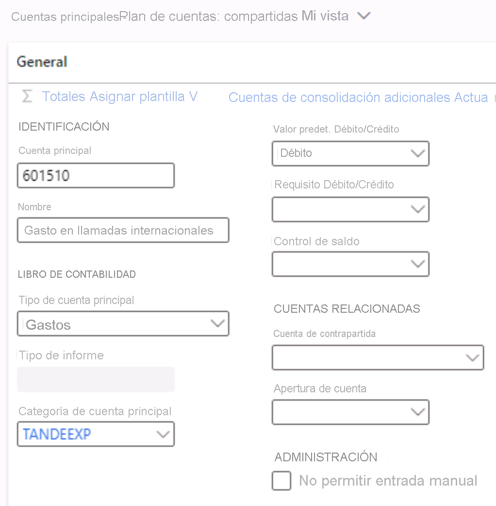

---
lab:
  title: 'Laboratorio 1: Creación de una cuenta principal'
  module: 'Module 2: Learn the Fundamentals of Microsoft Dynamics 365 Finance'
ms.openlocfilehash: 6568afcb26212ab952a48dfaf7bb4f377e4ffd36
ms.sourcegitcommit: aa74c0578c7018838f0c935f5901e9c667ef0801
ms.translationtype: HT
ms.contentlocale: es-ES
ms.lasthandoff: 07/14/2022
ms.locfileid: "147116656"
---
# Módulo 2: Obtener información sobre los fundamentos de Microsoft Dynamics 365 Finance
    
## Laboratorio 1: Creación de una cuenta principal

## Instrucciones

1. En la página de inicio de **Finance and Operations**, en la parte superior derecha, confirme que está trabajando con la empresa USMF.

2. Si es necesario, seleccione la empresa y, en el menú, seleccione **USMF**.

3. En el panel de navegación izquierdo, seleccione **Módulos** > **Contabilidad general** > **Plan de cuentas** > **Cuentas** > **Cuentas principales**.

4. En el menú superior, seleccione **+ Nuevo**.

5. Escriba estos valores en la página Cuenta principal:

    - Cuenta principal: **601510**

    - Nombre: **Gasto en llamadas internacionales**

    - Tipo de gasto principal: **Expense**

    - Categoría de cuenta principal: **TANDEEXP**

    - Valor predet. Debe/Haber: **Debe**

 
