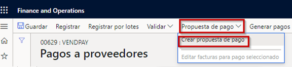
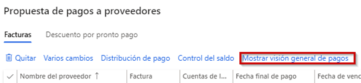
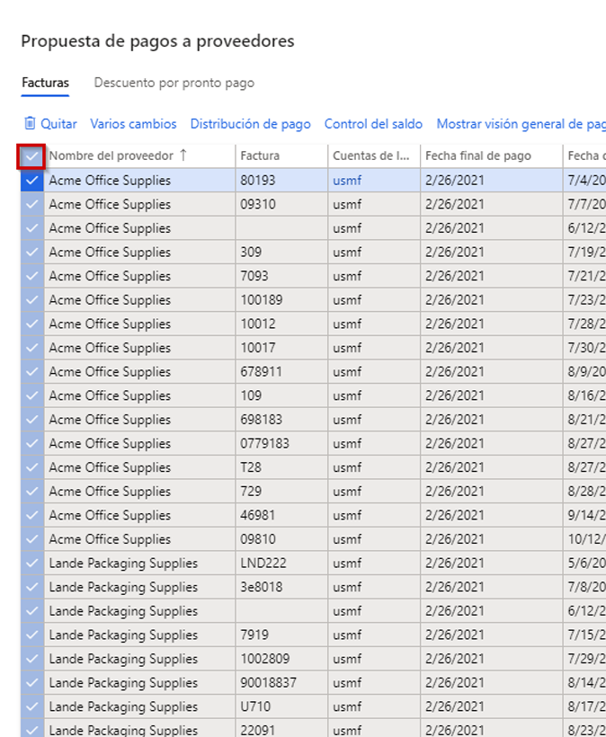
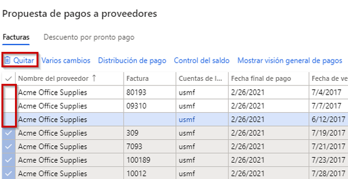

---
lab:
    title: 'Laboratorio 2: Crear un diario de pagos a proveedores'
    module: 'Módulo 2: Aprender los Fundamentos de Microsoft Dynamics 365 Finance'
---

## Laboratorio 2: Crear un diario de pagos a proveedores

## Objetivos

Las organizaciones que pagan a proveedores de forma periódica pueden ahora automatizar el proceso de generación de propuestas de pago a proveedores. Las automatizaciones de propuestas de pago a proveedores definen los siguientes detalles:

- Cuándo se ejecutan las propuestas de pago
- Qué criterios se utilizan para seleccionar las facturas que deben pagarse
- En qué diario de pagos a proveedores se guardan los pagos resultantes

Las automatizaciones de las propuestas de pago no registran automáticamente los pagos. Por lo tanto, puede seguir utilizando cualquier proceso de validación y flujo de trabajo que utilice actualmente para aprobar los pagos que se crean.

Crear una nueva entrada en el diario de pagos a proveedores y propuesta de pago.

## Configuración del laboratorio

   - **Tiempo estimado**: 10 minutos

## Instrucciones

1. En la página de inicio de Finance and Operations, en la parte superior derecha, compruebe que esté trabajando con la empresa USMF.

1. Si es necesario, seleccione la empresa y, en el menú, seleccione **USMF**.

1. En el panel de navegación izquierdo, seleccione **Módulos** > **Cuentas por pagar** > **Pagos** > **Diario de pagos a proveedores**.

1. En el menú superior, seleccione **+ Nuevo**.

1. Observe el nuevo Número de lote de diario que se ha creado.

1. En el cuadro **Nombre**, especifique **Vend** y luego seleccione **VendPay** en la lista filtrada.

1. En el menú superior, seleccione **Líneas**.

1. En la página de pagos a proveedores, en el menú superior, seleccione **Propuesta de pago** > **Crear propuesta de pago**.  
    La propuesta de pago es una consulta que se utiliza para seleccionar facturas que se van a pagar. Puede editar la lista de facturas a pagar antes de crear o generar los pagos a proveedores.

    

1. En el panel Propuesta de pago a proveedores, en **CRITERIOS DE SELECCIÓN DE FACTURAS**, seleccione el menú **Seleccionar factura por**, revise las opciones disponibles y luego seleccione **Fecha de vencimiento**.

1. En **Fecha desde** y **Fecha hasta**, elimine cualquier valor existente. Para este ejercicio, estos rangos de fechas se dejarán en blanco.

    >[!NOTA] Puede utilizarse una fecha de pago mínima como fecha de pago. La fecha de pago mínima será la fecha más temprana utilizada al crear los pagos. Por ejemplo, si una factura tiene una fecha de vencimiento posterior a la fecha de pago mínima, la fecha de vencimiento pasará a ser la fecha de pago, en lugar de la fecha de pago mínima, con la que se pagaría la factura en la última fecha posible.

1. Expanda **Registros que incluir** y revise las opciones.  
    El filtro se usa a menudo para restringir las facturas seleccionadas para el pago por grupo de proveedores o método de pago. Por ejemplo, puede agregar un filtro para pagar las facturas solo mediante cheque en esta ejecución de pagos.

1. Expanda **Parámetros avanzados** y revise las opciones disponibles.  
    Pueden usarse los parámetros avanzados para definir la divisa de pago o para habilitar pagos centralizados para esta ejecución de pagos.

1. Seleccione **Aceptar**.  
    Después de seleccionar Aceptar, aparecerán los resultados de la consulta. Si no desea obtener una vista previa de la lista de facturas seleccionadas para pagar, puede volver a la ficha desplegable Parámetros y cambiar **Crear pagos sin vista previa de factura** al valor **Sí**.

1. En la ventana Propuesta de pago a proveedores, seleccione **Mostrar resumen de pagos** para ver los pagos que se crearán para el proveedor en la factura seleccionada.

    

1. En el menú, seleccione **Ocultar resumen de pagos** para ocultar los pagos.

1. Seleccione el icono de marca de verificación a la izquierda del encabezado de la columna **Nombre del proveedor** para seleccionar todas las facturas.

    

1. Desmarque la casilla de las tres primeras facturas y luego, en el menú, seleccione **Eliminar** para eliminar el resto de facturas.

    

1. En el cuadro de diálogo, seleccione **Sí**.

1. Revise las tres facturas restantes.

1. Para exportar la lista de facturas a Excel, haga clic con el botón derecho en la cuadrícula y seleccione una opción de exportación.

1. En la esquina inferior derecha, seleccione **Crear pagos** para crear los pagos a proveedores en el diario de pagos.

1. Revise la lista de pagos a proveedores.
