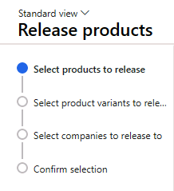

---
lab:
  title: 'Laboratorio 1: Crear un producto nuevo'
  module: 'Module 3: Learn the Fundamentals of Microsoft Dynamics 365 Supply Chain Management'
---

# Módulo 3: Obtener información sobre los fundamentos de Microsoft Dynamics 365 Supply Chain Management

## Laboratorio 1: Crear un producto nuevo

## Objetivo

En Contoso Entertainment System USA (USMF), tiene previsto comprar un nuevo modelo de un armario de un proveedor.  Tiene que crear un elemento para representar el nuevo modelo.  En este laboratorio, aprenderá a crear un elemento y configuraciones de elementos.

## Configuración del laboratorio

   - **Tiempo estimado**: 10 minutos

## Instrucciones

En Contoso Entertainment System USA (USMF), tiene previsto comprar un nuevo modelo de un armario de un proveedor.  Tiene que crear un elemento para representar el nuevo modelo. 

1.  En la página de inicio de Finance and Operations, en la parte superior derecha, compruebe que esté trabajando con la empresa **USMF**. Seleccione **USMF** en el menú desplegable de la empresa si es necesario.

2.  En la esquina superior izquierda, seleccione el menú de hamburguesa **Expandir el panel de navegación**.

3.  En el panel de navegación, seleccione **Módulos** y, a continuación, seleccione **Gestión de información del producto**. A continuación, en el menú **Productos**, seleccione **Productos**.

4.  En la página **Productos**, en el menú superior, seleccione **+ Nuevo**.

5.  En la página **Nuevo producto**, en el campo **Tipo de producto**, compruebe que **Artículo** está seleccionado.

6.  En el campo **Subtipo de producto**, compruebe que **Producto** está seleccionado.

7.  En **IDENTIFICACIÓN**, en el cuadro **Número de producto**, escriba **GTL007**.

8.  En el cuadro **Nombre de producto**, escriba **Armario 2**.

    

9.  Seleccione el botón **Aceptar**.

10. En el menú **Producto** del panel de acciones, seleccione **Grupos de dimensiones** en el grupo **Configurar** .

    

11. Seleccione el menú desplegable **Grupo de dimensiones de almacenamiento** y seleccione **SiteWH**.

12. Seleccione el menú desplegable **Grupo de dimensiones de seguimiento** y luego **Ninguno**.

13. Seleccione el botón **Aceptar**.

14. Seleccione el botón **Publicar productos** en el panel de acciones para publicar el producto en una persona jurídica.

15. Se abre una página que muestra el primer paso como **Seleccionar productos para publicar**.

    

16. Seleccione el botón **Siguiente** situado en la parte inferior de la página.

17. En la página **Seleccionar empresas para publicar**, seleccione la persona jurídica **USMF** donde se debe publicar el producto.

18. Seleccione el botón **Siguiente** situado en la parte inferior de la página.

19. En la página **Confirmar selección**, establezca el valor de **Mostrar registro de información tras un error** en **Sí** y **Ejecutar como lote** en **No**.

20. Seleccione el botón **Finalizar** ubicado en la parte inferior de la página.

21. En el panel de navegación, seleccione Módulos y, a continuación, seleccione Gestión de información del producto. A continuación, en el menú Productos, seleccione **Productos publicados**.

22. En la página **Productos de** **publicados**, busque el nuevo elemento **GTL007** en la cuadrícula. 

23. Seleccione el vínculo del producto y vaya a la página **Detalles del producto**.

24. En la pestaña desplegable **General**, especifique lo siguiente:

    - **Grupo de modelos de artículo**: FIFO

25. En la pestaña desplegable **Comprar** , escriba lo siguiente:

    - **Unidad**: ea

    - **Grupo de impuestos de artículo**: TODOS

    - **Precio**: 30

26. En la pestaña desplegable **Vender**, especifique lo siguiente:

    - **Unidad**: ea

    - **Grupo de impuestos de artículo**: TODOS

    - **Precio**: 35

27. En la pestaña desplegable **Administrar inventario**, escriba lo siguiente:

    - **Unidad**: ea

28. En la pestaña desplegable **Ingeniero**, escriba lo siguiente:

    - **Unidad BOM**: ea

29. En la pestaña desplegable **Administrar costos**, escriba lo siguiente:

    - **Grupo de artículos**: audio

30. Para completar la configuración, seleccione Producto en el panel de acciones. Seleccione el botón Validar en el grupo Mantener.

    

31. Compruebe que se le presenta el banner de información que confirma que todos los valores de campo obligatorios se validaron.

    

32. Cierre todas las páginas y vuelva a la página de inicio.
