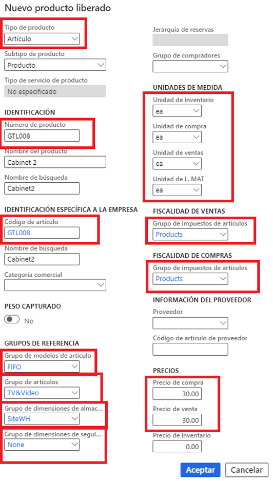
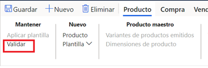
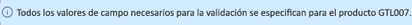

---
lab:
  title: 'Laboratorio 1: Crear un producto nuevo'
  module: 'Module 3: Learn the Fundamentals of Microsoft Dynamics 365 Supply Chain Management'
ms.openlocfilehash: e8fad0a9ddf0787c57ee7b98ddc6ef8363832ffc
ms.sourcegitcommit: 178a1e5d74c3902b0514276a3daf4a24c0c4ade7
ms.translationtype: HT
ms.contentlocale: es-ES
ms.lasthandoff: 08/01/2022
ms.locfileid: "147444376"
---
# Módulo 3: Obtener información sobre los fundamentos de Microsoft Dynamics 365 Supply Chain Management

## Laboratorio 1: Creación de un producto nuevo

## Objetivos

En Contoso Entertainment System USA (USMF), debe crear un nuevo artículo para una nueva configuración de armario que se comprará a los proveedores.

## Configuración del laboratorio

   - **Tiempo estimado**: 10 minutos

## Instrucciones

1. En la página de inicio de Finance and Operations, en la parte superior derecha, compruebe que esté trabajando con la empresa USMF.

1. Si es necesario, seleccione la empresa y, en el menú, seleccione **USMF**.

1. En la esquina superior izquierda, seleccione el menú de hamburguesa **Expandir el panel de navegación**.

1. En el panel de navegación, seleccione **Módulos** > **Gestión de información de productos** y, en la categoría **Productos**, seleccione **Productos liberados**.

1. En la página Detalles de producto liberado, en el menú superior, seleccione **+ Nuevo**.

1. En el panel Nuevo producto liberado, en el menú **Tipo de producto**, compruebe que **Artículo** está seleccionado.

1. En el menú **Subtipo de producto**, verifique que **Producto** está seleccionado.

1. Seleccione el menú **Grupo de dimensiones de seguimiento** y luego **Ninguno**.

1. En **IDENTIFICACIÓN**, en las casillas **Número de producto** y **Número de artículo**, escriba **GTL007**.

1. En el cuadro **Nombre de producto**, escriba **Armario 2**.

1. En **GRUPOS DE REFERENCIA**, seleccione el menú **Grupo de modelos de artículo** y luego **FIFO (el primero en entrar; el primero en salir)** .

1. Seleccione el menú **Grupo de artículo** y luego **Televisión y vídeo**.

1. Seleccione el menú **Grupo de dimensiones de almacenamiento** y luego **SiteWH**.

1. En **UNIDADES DE MEDIDAS**, compruebe que se establezcan los siguientes valores:

    | **Configuración**| **Valor**|
    | :--- | :--- |
    | Unidad de inventario| ud. (cada una)|
    | Unidad de compra| ud. (cada una)|
    | Unidad de ventas| ud. (cada una)|
    | Unidad de L. MAT| ud. (cada una)|

1. En **FISCALIDAD DE VENTAS**, seleccione el menú **Grupo de impuestos de artículos** y luego **TODOS**.

1. En **FISCALIDAD DE COMPRAS**, seleccione el menú **Grupo de impuestos de artículos** y luego **TODOS**.

1. En PRECIOS, en el cuadro Precio de compra, escriba 30,00.

1. En el cuadro Precio de venta, escriba 30,00.

1. Su nuevo producto liberado debería tener el siguiente aspecto:

    

1. Seleccione **Aceptar**.

1. Para asegurarse de que el producto esté finalizado, en la barra de la cinta, en **Mantener**, seleccione **Validar**.

    

1. Compruebe que se le presenta el banner de información que confirma que todos los valores de campo obligatorios se validaron.

    

1. Cierre todas las páginas y vuelva a la página de inicio.
