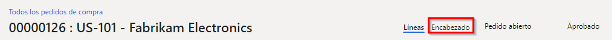
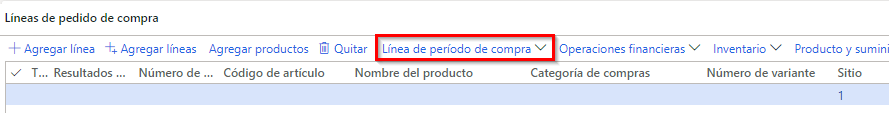

---
lab:
  title: 'Laboratorio 2: Crear un pedido de compra'
  module: 'Module 3: Learn the Fundamentals of Microsoft Dynamics 365 Supply Chain Management'
ms.openlocfilehash: 3fe707e54f1fe2e84b773f92ca75ba0e025e7f4e
ms.sourcegitcommit: 8e5a278c6e08abdcc3fb719796f79842e868606b
ms.translationtype: HT
ms.contentlocale: es-ES
ms.lasthandoff: 07/14/2022
ms.locfileid: "147116354"
---
# Módulo 3: Obtener información sobre los fundamentos de Microsoft Dynamics 365 Supply Chain Management

## Laboratorio 2: Creación de un pedido de compra

## Objetivos

Es más común que los pedidos de compra se creen automáticamente como resultado de la planificación maestra, la entrega directa y otros procesos. Cuando se crean de forma manual, los pedidos de compra suelen crearse por un agente de compras. Crear un pedido de compra mediante la empresa USMF.

## Configuración del laboratorio

   - **Tiempo estimado**: 10 minutos

## Instrucciones

1. En la página de inicio de Finance and Operations, en la parte superior derecha, compruebe que esté trabajando con la empresa USMF.

1. Si es necesario, seleccione la empresa y, en el menú, seleccione **USMF**.

1. En la esquina superior izquierda, seleccione el menú de hamburguesa **Expandir el panel de navegación**.

1. Seleccione **Módulos** > **Adquisiciones y abastecimiento** > **Pedidos de compra** > **Todos los pedidos de compra**.

1. En la página Todos los pedidos de compra, en el menú superior, seleccione **+ Nuevo**.

1. En el panel Crear pedido de compra, seleccione el menú **Cuenta del proveedor** y, después, seleccione **US-101**.

1. Al seleccionar un proveedor, los detalles del registro del proveedor, como la dirección, la cuenta de la factura, y las condiciones y el modo de entrega, se copiarán como valores predeterminados en el encabezado del pedido. Puede cambiar estos valores en cualquier momento.

1. Expanda la sección **General**.

1. Debajo de **DIMENSIONES DE ALMACENAMIENTO**, seleccione el menú **Sitio** y revise la lista de sitios.

1. El campo Sitio, junto con el campo Almacén, especifica dónde deben entregarse los bienes o servicios adquiridos. La dirección predeterminada de entrega es el sitio. Ambos campos se pueden rellenan con valores configurados para el proveedor seleccionado, o puede especificarlos manualmente.

1. Debajo de **FECHAS**, el campo Fecha de entrega se utiliza para especificar cuándo deben entregarse los bienes y servicios adquiridos.

1. Puede especificar una fecha de entrega única para el pedido, o las líneas de pedido individuales pueden tener fechas de entrega únicas. Si la fecha de entrega especificada aquí no se puede cumplir para bienes o servicios específicos porque tienen plazos de entrega más largos, esas líneas se crearán con una fecha de entrega posterior para adaptarse a esta circunstancia.

1. Expanda la sección **Administración**. El cuadro **Solicitante** se puede utilizar para especificar quién realiza el pedido.

1. Esto puede ser práctico para compartir con el proveedor en caso de que necesite ponerse en contacto con esa persona. El valor se puede asignar automáticamente si la cuenta de usuario actual está asociada a un nombre de la página Usuarios.

1. Seleccione **Aceptar**.

1. Se ha creado el encabezado del pedido. Cuando trabaja con líneas de pedidos de compra, solo se muestra un resumen de la información del encabezado. Si necesita ver el resto de la información, seleccione **Encabezado**.

    

1. Debajo de **Líneas de pedido de compra**, en el menú, seleccione **Línea de pedido de compra**.

    

1. Debajo de **MOSTRAR**, seleccione **Dimensiones**.

1. Los productos pueden encontrarse en variantes que se diferencian por dimensiones, como color, tamaño o estilo. Los productos también se pueden configurar para usar dimensiones de almacenamiento, como sitio y almacén. También hay dimensiones de seguimiento opcionales, como números de serie y de lote. Para mejorar la eficiencia de la entrada de pedidos, puede agregar los campos de dimensión que normalmente utiliza directamente en la cuadrícula de pedidos.

1. En el panel Presentación de dimensiones, en **DIMENSIONES DEL PRODUCTO**, seleccione el cuadro **Color**.

1. Opcional: Si selecciona el conmutador de alternancia Guardar configuración, las dimensiones que ha elegido también se mostrarán en la cuadrícula de la línea de pedido la próxima vez que abra la página de pedido de compra.

1. Seleccione **Aceptar**.

1. Seleccione el menú de celda **Código de artículo** y, a continuación, **T0004**.

1. Recuerde que también puede escribir el cuadro de filtro en lugar de desplazarse por la lista.

1. Las líneas de pedido se crean para productos y servicios mediante la especificación de un código de producto o como gastos si se especifica una categoría de compras.

1. La categoría de compras se usa para agregar líneas donde los artículos adquiridos se cargan directamente, en lugar de ir al inventario. Esto significa que si necesita cargar una compra como gasto, puede hacerlo si crea una línea de pedido de compra que especifique una categoría de compras, en lugar de crear una línea con un código de artículo. Los artículos también se pueden asociar a una categoría de compras y, en este caso, la categoría de compra se muestra solo de modo informativo.

1. Seleccione el menú **Color**, revise las opciones disponibles y luego seleccione uno de los colores o combinaciones de colores.

1. El sitio y el almacén generalmente se rellenan con los valores del encabezado del pedido, pero es posible invalidar los campos si algunas líneas deben entregarse en diferentes ubicaciones.

1. En el cuadro **Cantidad**, escriba **10**.

1. El campo Cantidad se rellena automáticamente con la cantidad de pedido mínima para el producto si está configurado, o con el valor de 1.

1. Información adicional:

    - **Unidad**: indica la unidad de medida para la cantidad pedida. Normalmente, la unidad se obtiene automáticamente de la unidad de compra en los datos maestros de producto.

    - **Precio unitario**: contiene un valor de un acuerdo de compra o de un acuerdo comercial. Se puede cambiar el precio unitario en líneas de pedido individuales, por ejemplo, si se negocia un precio único con el proveedor.

    - **Descuento**: representa un importe de descuento por unidad. Por tanto, este descuento reduce el precio unitario por el descuento. Este descuento suele darse automáticamente a partir de acuerdos de compra o acuerdos comerciales, pero es posible invalidar en líneas individuales si se han negociado descuentos únicos con el proveedor.

    - **Porcentaje de descuento**: cuando se especifica, reduce el importe neto de la línea en consecuencia. El porcentaje de descuento suele darse automáticamente a partir de acuerdos de compra o acuerdos comerciales, pero es posible invalidar en líneas individuales si se ha negociado un porcentaje de descuento único con el proveedor.

    - **Importe neto**: se calcula a partir de otros campos de la línea, incluida la cantidad, el precio unitario, el descuento y el porcentaje de descuento. Es posible cambiar el Importe neto, pero entonces los campos Precio unitario, Descuento y Porcentaje de descuento estarán en blanco, y cuando publique para la línea, el importe registrado será proporcional al importe neto. Por lo general, el campo Importe neto solo se usa para mostrar el importe neto de la línea.

1. Debajo de las líneas de pedido de compra, en la parte inferior de la página, seleccione **Detalles de línea**.

1. Seleccione la pestaña **Entrega**.

1. Se puede asignar una fecha de entrega única a cada línea de pedido. La fecha se hereda del campo del encabezado del pedido de compra, pero puede cambiarlo.

1. Cierre la página Línea de pedido de compra.

1. En la página Todos los pedidos de compra, use la función Filtro y busque su nuevo pedido de compra.

1. Cuando termine, cierre la página Todos los pedidos de compra y vuelva a la página de inicio.
