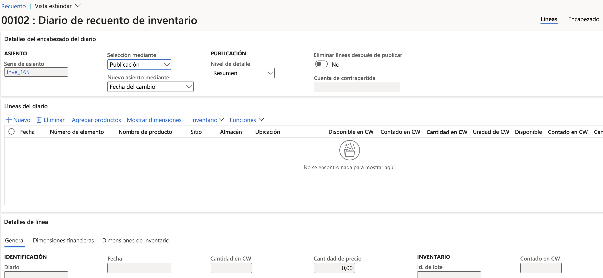

---
lab:
  title: 'Laboratorio 3: Creación de un diario de recuento'
  module: 'Module 3: Learn the Fundamentals of Microsoft Dynamics 365 Supply Chain Management'
---

# Módulo 3: Obtener información sobre los fundamentos de Microsoft Dynamics 365 Supply Chain Management

## Laboratorio 3: Creación de un diario de recuento

## Configuración del laboratorio

   - **Tiempo estimado**: 10 minutos

## Instrucciones

1.  En la **página de inicio de Finance and Operations**, en la parte superior derecha, compruebe que esté trabajando con la empresa **USMF**. Si es necesario, seleccione la empresa y, en el menú desplegable, seleccione **USMF**. 

2.  1\. En el panel de navegación izquierdo, en el módulo **Administración de inventario**, seleccione **Movimientos de diario** > **Recuento de artículos** > **Recuento**. 

3.  Seleccione el botón **+Nuevo** en el panel de acciones. Aparecerá el panel de diálogo **Crear diario de inventario**. Seleccione el botón **Aceptar**. 

4.  El formulario del **diario de recuento de inventario** aparecerá con encabezado e información de líneas. 

    

5.  En el panel de acciones, seleccione **Crear líneas:&gt; a mano**. 

6.  En el panel de diálogo **Crear el diario de recuento disponible**, establezca los campos **Almacén**, **Estado de inventario**, **Ubicación** y **Matrícula de entidad de almacén** en **Sí**. 

    

7.  Expanda la sección **Registros que incluir** y seleccione el botón **Filtrar**. Para el campo **Número de artículo**, escriba `A0001` en el campo **Criterios** y seleccione **Aceptar**. 

8.  Seleccione **Aceptar** en la parte inferior del panel de diálogo **Crear el diario de recuento disponible**. 

    La cantidad disponible del artículo **A0001** aparecerá en la sección **Líneas de diario**, con un desglose por sitio, almacén y ubicación. 

9.  En la columna **Recuento** de la sección **Línea del diario**, haga coincidir los números del recuento para cada Sitio/Almacén y Ubicación. Tenga en cuenta lo siguiente: 

    - Si la cantidad **Disponible** es la misma que la cantidad reflejada en **Contado**, el campo **Cantidad** estará en blanco. 

    - Si el valor del campo **Contado** es mayor que el campo **Disponible**, el campo **Cantidad** contendrá un valor positivo. 

    - Si el valor del campo **Contado** es menor que el campo **Disponible**, el campo **Cantidad** contendrá un valor negativo. 

10. Cambie el año del campo **Fecha** en cada línea a 2022. 

11. Seleccione el botón **Validar** en el panel de acciones y, a continuación, seleccione **Aceptar** en el panel del diálogo. 

12. Seleccione el botón **Registrar**. 

13. **Cierre** la página y vuelva a la página de inicio. 

